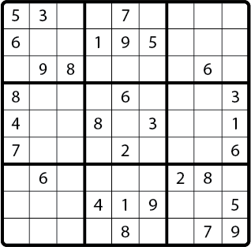

# Sudoku

## Summary
  
*Figure 1*.  Animation solving a sudoku puzzle and partially verifying the solution.

[Sudoku](http://en.wikipedia.org/wiki/Sudoku) is a logic-based, combinatorial number-placement puzzle. The objective is to fill a 9×9 grid with digits so that each column, each row, and each of the nine 3×3 sub-grids that compose the grid (also called "boxes") contains the digits from 1 to 9.

Generally, a puzzle provides a partial solution so that some squares already have numbers.  To solve the puzzle, we need to fill in the unsolved squares, as demonstrated in Figure 1.

By the end of this challenge we'll have a fully functioning Sudoku solver that runs from the command line.  We'll be presented with 15 unsolved Sudoku puzzles.  The puzzles can be found in the file `sudoku_puzzles.txt`.  Five puzzles can be solved with basic logic.  Five require slightly more advanced logic.  Five require educated guessing.  A complete solution to this challenge will solve all 15 puzzles.


## Releases
### Pre-release: Understanding and Modeling Sudoku
A computer program that solves Sudoku is simulating a person playing Sudoku.  Understanding how a person plays the game is key.  What does someone do when solving a Sudoku puzzle?

Let's play an actual Sudoku puzzle, paying attention to how we approach the problem.

- What strategies are we adopting and why?
- How do we choose where to start?
- How do we know when to really put a number in a square?
- What do we do when we don't definitively know how to fill in any more squares?

Reflecting on our human strategy, it's important to see that sometimes the strategies that work for humans would be difficult to implement on a computer.  However, the reverse is also true: strategies humans avoid because we'd have to write too much, use too many sheets of paper, or remember too much information are possible for a computer.

Before we begin coding, let's develop and write a pseudocode solution.


### Release 0: Basic Logic
The first five puzzles in the file `sudoku_puzzles.txt` can be solved with basic logic: identifying when a square has only one possible value.  For this release, we want to develop our solver to the point of solving these first five puzzles.

- We'll build a `Sudoku` class, the beginnings of which can be found in the file `sudoku.rb`.  Our solver will be an instance of this class; see the driver code provided in the file `runner.rb`.

- A solver is instantiated with a `String` representing an unsolved Sudoku board as its argument.  Unsolved squares are marked with a `"-"`.  Solved squares have a character from `"1"` to `"9"`.

  For example ...

  `"1-58-2----9--764-52--4--819-19--73-6762-83-9-----61-5---76---3-43--2-5-16--3-89--"`

- The `Sudoku` class should have an instance method `#board` that returns the current state of the board in the same format as the argument passed in when instantiating a solver (i.e., an 81-character string).

- The `Sudoku` class should have an instance method `#solve` that attempts to solve the board.  For Release 0, the board should give up, if it gets stuck.


- Be sure to write the `Sudoku#to_s` method, so that you can see what your board looks like after running the `Sudoku#solve` method.  A `#to_s` method determines how an object is represented in string-form; it should return a `String` object, not `puts` anything to the console.

  After defining the `#to_s` method, running the following code ...

  ```ruby
  board = "1-58-2----9--764-52--4--819-19--73-6762-83-9-----61-5---76---3-43--2-5-16--3-89--"

  game = Sudoku.new(board)
  puts game

  ```

  would print something approximating ...

  ```
  1 - 5 8 - 2 - - -
  - 9 - - 7 6 4 - 5
  2 - - 4 - - 8 1 9
  - 1 9 - - 7 3 - 6
  7 6 2 - 8 3 - 9 -
  - - - - 6 1 - 5 -
  - - 7 6 - - - 3 -
  4 3 - - 2 - 5 - 1
  6 - - 3 - 8 9 - -
  ```


### Release 1:  More Advanced Logic
Puzzles 6 - 10 can be solved using logic alone but require more than just identifying when a square has only one possible value.  Let's enhance the behavior of our `Sudoku#solve` method to solve these puzzles.

*Note:* The `#solve` method should still give up if it gets stuck.


### Release 2:  Educated Guessing
Puzzles 11 - 15 can be solved by making informed guesses about the values of unsolved squares and then trying to solve the puzzles based on those guessed values.  Guessing should be started once our `Sudoku#solve` method gets stuck.  In other words, solve as many squares as possible using logic and then start guessing.


## Conclusion
Writing a Sudoku solver presents a lot of problems:  identifying the logic involved in the game itself, translating that logic to code, manipulating data structures, etc.  It provides a nice comprehensive challenge, summing the skills that we've developed to this point at Dev Bootcamp.
